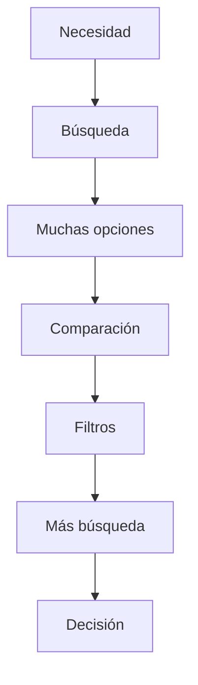
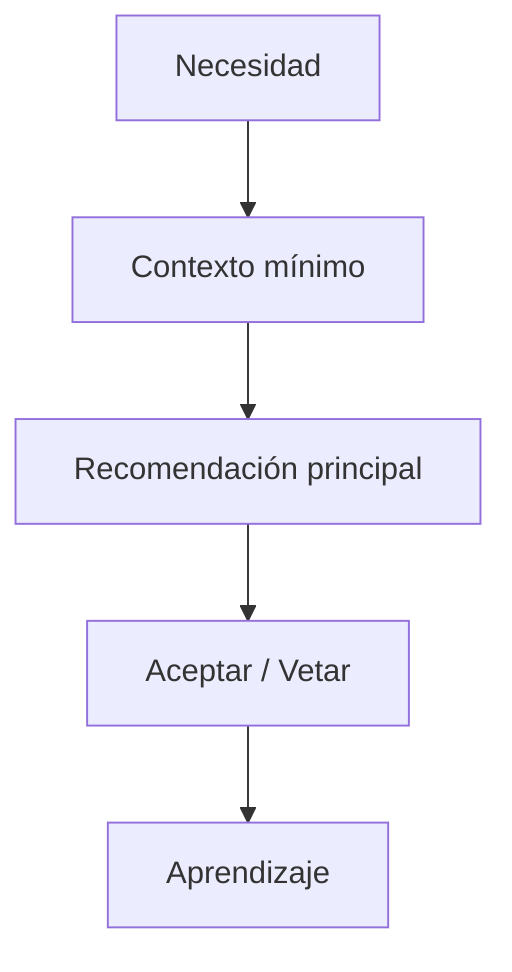
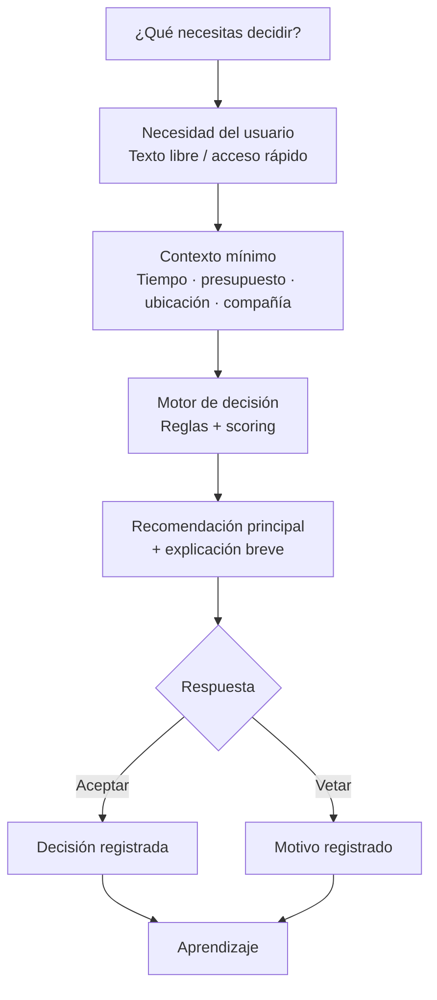
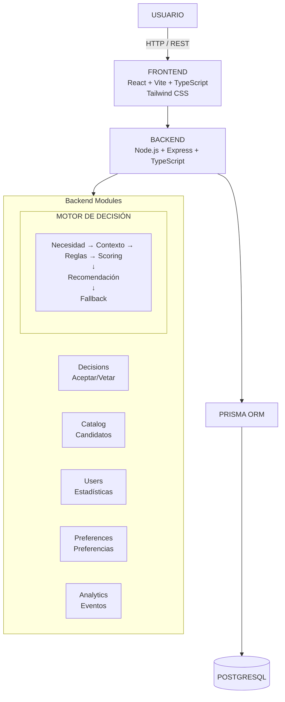
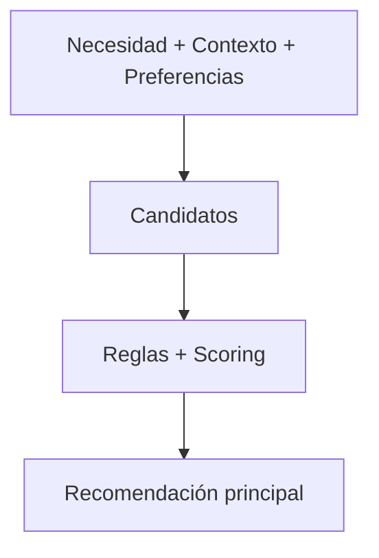
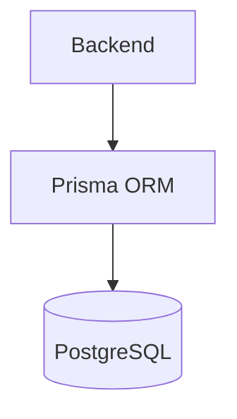
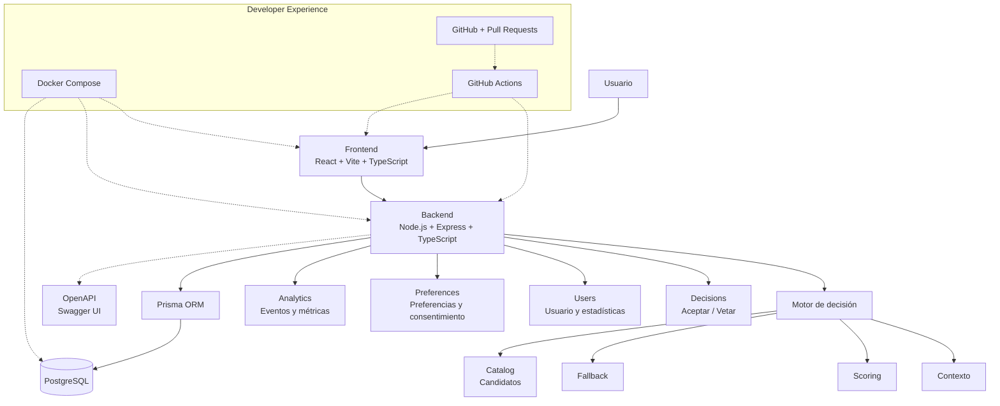
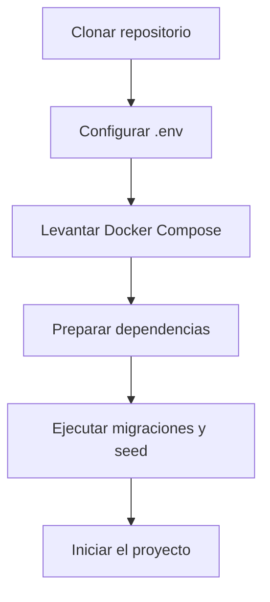
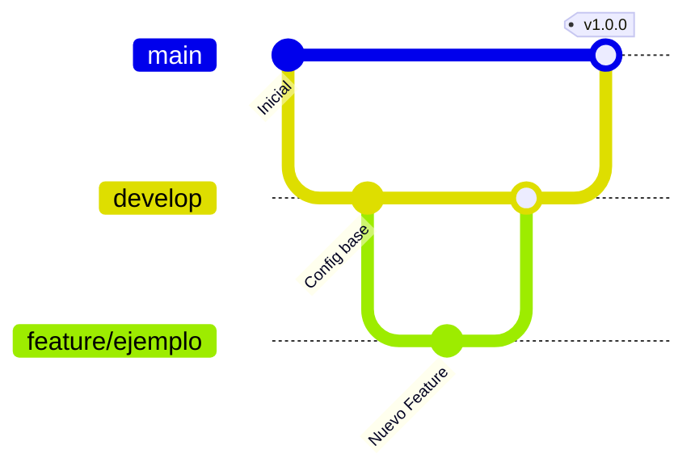
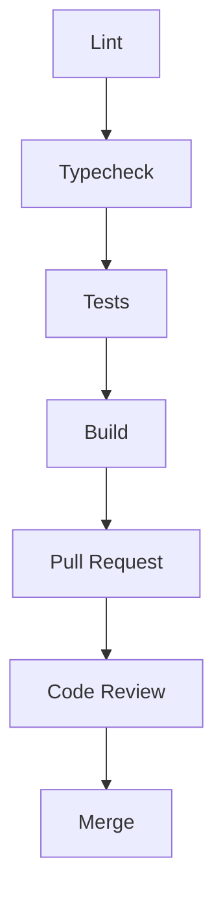

<!-- markdownlint-disable MD033 MD041 -->

<div align="center">

<h1>NOSE</h1>

<p><strong>No busques. NOSE.</strong></p>

<p>Plataforma para reducir la fatiga de decisión mediante recomendaciones contextuales.</p>

<p>
  <a href="#estado-del-proyecto"></a>
  <a href="LICENSE"></a>
</p>

<p>
  <a href="docs/ARCHITECTURE.md">Arquitectura</a> ·
  <a href="Propuesta.pdf">Propuesta NOSE</a> ·
  <a href="docs/MVP_SCOPE.md">Alcance del MVP</a> ·
  <a href="CONTRIBUTING.md">Contribuir</a>
</p>

</div>

<!-- markdownlint-enable MD033 MD041 -->

---

## ¿Qué es NOSE?

NOSE es una plataforma orientada a reducir la **fatiga de decisión**.

En lugar de presentar al usuario una gran cantidad de opciones para que tenga que compararlas, NOSE busca comprender qué necesita decidir, recopila el contexto mínimo necesario y propone una opción principal.

El primer caso de uso de la plataforma es **Qué Comer**, un MVP enfocado en ayudar al usuario a tomar decisiones relacionadas con comida de acuerdo con sus necesidades y contexto.

NOSE busca transformar una situación como:

> "No sé qué comer."

en una decisión concreta:

> "NOSE, decide por mí."

El objetivo es ofrecer una experiencia rápida, contextual y sencilla, evitando que el usuario tenga que recorrer una lista interminable de opciones.

---

## Génesis del proyecto

NOSE nace a partir de una problemática cotidiana: las personas tienen cada vez más opciones disponibles, pero disponer de más alternativas no necesariamente facilita tomar una decisión.

Elegir dónde comer, qué ver o qué hacer puede convertirse en un proceso de búsqueda, comparación y descarte.

La idea inicial del proyecto estuvo enfocada en una aplicación de recomendaciones de comida. Durante la definición del producto, el concepto evolved hacia una plataforma capaz de ayudar a las personas a **delegar decisiones cotidianas**.

A partir de esta visión se estableció **Qué Comer** como primer módulo del proyecto, con un alcance reducido que permita construir y validar el concepto antes de incorporar nuevos tipos de decisiones.

---

## Problema que resuelve

La abundancia de alternativas puede convertir decisiones cotidianas en procesos innecesariamente largos.

Las plataformas tradicionales suelen responder a una necesidad mostrando múltiples opciones:



NOSE plantea un enfoque diferente:



La intención no es mostrar más opciones, sino **reducir el esfuerzo necesario para llegar a una decisión útil**.

---

## Propuesta de valor

NOSE busca convertir una necesidad expresada de forma natural en una decisión concreta.

El usuario puede expresar algo como:

> "Tengo poco tiempo y quiero comer algo barato."

A partir de esta necesidad, el sistema obtiene el contexto mínimo necesario, evalúa los candidatos disponibles y presenta una recomendación principal.

El flujo central del producto es:

**Necesidad → Contexto mínimo → Recomendación → Aceptar / Vetar → Feedback**

Cuando el usuario acepta una recomendación, la decisión queda registrada. Si la veta, puede indicar el motivo y el sistema utiliza esa información como parte del aprendizaje de preferencias.

---

## Objetivos

### Objetivo general

Construir una plataforma capaz de reducir la fatiga de decisión mediante recomendaciones contextuales, comenzando con el módulo **Qué Comer**.

### Objetivos específicos

- Permitir expresar necesidades mediante texto libre y accesos rápidos.
- Solicitar únicamente el contexto necesario para generar una recomendación.
- Presentar una opción principal en lugar de una lista extensa.
- Permitir aceptar o vetar una recomendación.
- Registrar feedback para mejorar futuras decisiones.
- Mantener preferencias básicas del usuario.
- Medir el comportamiento del flujo de decisión.
- Diseñar una arquitectura que permita incorporar nuevos módulos en fases posteriores.

---

## Flujo principal

El MVP se centra en un flujo corto:



El MVP busca que el usuario pueda llegar a una recomendación en pocas interacciones, evitando procesos largos de búsqueda y comparación.

---

# Arquitectura

## Visión general

NOSE utiliza una **arquitectura modular** orientada a separar las responsabilidades principales del sistema:



### Frontend

El frontend es responsable de la interacción con el usuario.

Utiliza:

- React.
- Vite.
- TypeScript.
- Tailwind CSS.

Sus principales responsabilidades son:

- Capturar la necesidad del usuario.
- Mostrar accesos rápidos.
- Solicitar el contexto mínimo.
- Mostrar la recomendación principal.
- Mostrar la explicación.
- Permitir aceptar o vetar.
- Mostrar información relacionada con XP y racha.
- Presentar estados de carga y error.

### Backend

El backend proporciona la API REST y contiene la lógica principal del sistema.

Utiliza:

- Node.js.
- Express.
- TypeScript.
- Prisma ORM.

El backend se organiza mediante módulos para mantener separadas las responsabilidades del sistema.

### Motor de decisión

El motor de decisión constituye el **núcleo funcional del MVP**.

Su responsabilidad es transformar:



El motor prioriza una recomendación principal en lugar de devolver una lista extensa de alternativas.

También contempla un mecanismo de **fallback** para los casos en los que no exista una coincidencia suficientemente adecuada.

El motor se diseña de forma genérica para permitir la incorporación futura de otros módulos de decisión, aunque el MVP únicamente implementa **Qué Comer**.

### Módulo Decisions

Gestiona las decisiones realizadas por el usuario.

Incluye:

- Recomendaciones generadas.
- Aceptaciones.
- Vetos.
- Motivos de veto.
- Información necesaria para el aprendizaje.

### Módulo Catalog

Contiene los candidatos que pueden ser considerados por el motor de decisión.

Durante el MVP, el catálogo inicial se carga mediante **seed**.

No se contempla un panel administrativo para gestionar el catálogo dentro del alcance inicial.

### Módulo Users

Gestiona la información básica del usuario y los datos necesarios para su experiencia dentro de la plataforma.

### Módulo Preferences

Gestiona las preferencias y el consentimiento del usuario.

Estas preferencias pueden utilizarse para mejorar futuras recomendaciones.

### Módulo Analytics

Registra eventos relevantes del comportamiento del usuario.

Permite calcular métricas como:

- Activation Rate.
- Decision Completion Rate.
- Veto Rate.
- Time to Value.

### Persistencia

La persistencia se realiza mediante:



Prisma funciona como capa de acceso y modelado de datos entre el backend y PostgreSQL.

---

## Arquitectura resumida

El flujo principal de componentes puede representarse mediante el siguiente diagrama:



La arquitectura detallada, las decisiones técnicas y la organización interna del sistema se encuentran en [`docs/ARCHITECTURE.md`](docs/ARCHITECTURE.md).

---

## Alcance del MVP

El primer MVP corresponde al módulo **Qué Comer**.

### Incluido

- Entrada mediante texto libre.
- Accesos rápidos relacionados con comida.
- Captura de contexto mínimo.
- Catálogo inicial de candidatos.
- Motor de decisión basado en reglas y scoring.
- Recomendación principal.
- Explicación breve de la recomendación.
- Aceptar / Vetar.
- Motivo de veto.
- Preferencias básicas.
- Aprendizaje inicial a partir del feedback.
- XP y racha con alcance mínimo.
- Registro de eventos y métricas.
- Fallback cuando no existe una coincidencia adecuada.
- Consentimiento y consideraciones básicas de privacidad.
- Arquitectura modular preparada para futuras extensiones.

### Fuera del MVP

- Acuerdos comerciales con restaurantes.
- Monetización.
- Reservas, pedidos o pagos.
- Integraciones externas.
- Otros módulos como Qué Ver, A Dónde Ir o Estudio.
- Botón del Caos.
- Modo parejas o grupos.
- Sistema avanzado de gamificación.
- Panel administrativo para gestionar el catálogo.
- Integraciones con mapas, clima o servicios externos.

El alcance detallado se encuentra en [`docs/MVP_SCOPE.md`](docs/MVP_SCOPE.md).

---

## Tecnologías

### Frontend

- React.
- Vite.
- TypeScript.
- Tailwind CSS.

### Backend

- Node.js.
- Express.
- TypeScript.
- Prisma ORM.
- PostgreSQL.

### API y documentación

- REST API.
- OpenAPI.
- Swagger UI.

### Desarrollo y calidad

- Docker.
- Docker Compose.
- Git.
- GitHub.
- GitHub Actions.
- ESLint.
- Prettier.
- Husky.
- lint-staged.
- Vitest.
- Supertest.
- Playwright.

---

## Developer Experience

NOSE busca que el entorno de desarrollo sea reproducible y sencillo de configurar.

La experiencia esperada para un nuevo integrante es:



El objetivo es que un desarrollador pueda preparar el proyecto en menos de 30 minutos siguiendo la documentación.

Las herramientas de DX incluyen:

- Docker Compose para el entorno de desarrollo.
- PostgreSQL como base de datos.
- Seed reproducible para datos iniciales.
- `.env.example` para variables de entorno.
- OpenAPI como contrato de API.
- Mock API derivada del contrato.
- ESLint y Prettier para calidad y formato.
- Husky y lint-staged para validaciones locales.
- GitHub Actions para CI.
- Pruebas unitarias, de integración y E2E.
- CODEOWNERS y reglas de revisión.
- Documentación de onboarding.

La configuración y las reglas de contribución se encuentran en [`CONTRIBUTING.md`](CONTRIBUTING.md).

---

## Equipo

NOSE es desarrollado por un equipo de siete integrantes organizado por áreas de trabajo.

| Integrante | Rol | Responsabilidades |
| --- | --- | --- |
| **Patrick Marquez Yances** | Co-CEO | Debug, historias de usuario y documentación |
| **Estefani** | Co-CEO | Debug, historias de usuario y documentación |
| **Sebas** | Backend / Base de datos | Desarrollo backend y diseño de base de datos |
| **Daniel** | Backend / IA Core | Desarrollo backend y núcleo de decisión |
| **Luan** | Frontend / UI/UX | Desarrollo frontend y diseño de interfaz |
| **Sofia** | Frontend / UI/UX | Desarrollo frontend y diseño de interfaz |
| **Bolaños** | Por definir | Rol pendiente de asignación |

Los cargos de **Co-CEO de Patrick y Estefani son equivalentes**, con las mismas responsabilidades y participación en la dirección del proyecto.

---

## Estructura del repositorio

La estructura propuesta busca separar responsabilidades y facilitar el mantenimiento del proyecto.

```text
NOSE/
├── backend/
│   ├── src/
│   │   ├── modules/
│   │   │   ├── decisions/
│   │   │   ├── users/
│   │   │   ├── preferences/
│   │   │   ├── catalog/
│   │   │   └── analytics/
│   │   ├── core/
│   │   └── config/
│   ├── prisma/
│   │   ├── schema.prisma
│   │   └── seed.ts
│   └── tests/
│
├── frontend/
│   └── src/
│       ├── components/
│       ├── pages/
│       ├── features/
│       ├── services/
│       ├── hooks/
│       └── types/
│
├── docs/
│   ├── ADR/
│   ├── api/
│   │   └── openapi.yaml
│   ├── ARCHITECTURE.md
│   └── MVP_SCOPE.md
│
├── tests/
│   └── e2e/
│
├── .github/
│   ├── workflows/
│   ├── CODEOWNERS
│   ├── pull_request_template.md
│   └── dependabot.yml
│
├── docker-compose.yml
├── .env.example
├── .gitignore
├── package.json
└── README.md
```

---

## Flujo de trabajo

El desarrollo utiliza Git y GitHub mediante ramas y Pull Requests.

### Ramas principales



### Reglas principales

- `main` representa el estado estable.
- `develop` funciona como rama de integración.
- No se realizan commits directos sobre `main` o `develop`.
- Los cambios se desarrollan mediante ramas específicas.
- Todo cambio relevante se integra mediante Pull Request.
- Las Pull Requests deben pasar las validaciones de CI.
- Los cambios deben ser revisados antes de integrarse.
- Las ramas deben eliminarse después del merge.

### Convención de commits

El proyecto utiliza **Conventional Commits**.

Ejemplos:

```text
feat: agregar motor de recomendación
fix: corregir cálculo de scoring
docs: actualizar arquitectura
test: agregar pruebas para decisiones
refactor: reorganizar módulo de preferencias
chore: actualizar dependencias
```

---

## Calidad y validaciones

Los cambios deben cumplir las validaciones establecidas para el proyecto.

El flujo esperado es:



Dependiendo del cambio pueden utilizarse:

- Tests unitarios con Vitest.
- Tests de integración con Supertest.
- Tests E2E con Playwright.
- ESLint.
- Prettier.
- TypeScript.
- GitHub Actions.

La Definition of Done y las reglas detalladas se encuentran en [`CONTRIBUTING.md`](CONTRIBUTING.md).

---

## Documentación

La documentación técnica se mantiene separada del README principal.

| Documento | Descripción |
| --- | --- |
| [`README.md`](README.md) | Presentación general del proyecto |
| [`docs/ARCHITECTURE.md`](docs/ARCHITECTURE.md) | Arquitectura y organización técnica |
| [`docs/MVP_SCOPE.md`](docs/MVP_SCOPE.md) | Alcance y exclusiones del MVP |
| [`CONTRIBUTING.md`](CONTRIBUTING.md) | Reglas para contribuir al proyecto |
| [`docs/ADR/`](docs/ADR/) | Decisiones importantes de arquitectura |
| [`docs/api/openapi.yaml`](docs/api/openapi.yaml) | Contrato de la API |
| [`Propuesta.pdf`](Propuesta.pdf) | Propuesta general del proyecto |

Los documentos deben actualizarse cuando un cambio modifica decisiones, procesos o comportamientos documentados.

---

## Métricas del MVP

El MVP contempla métricas orientadas a evaluar si NOSE realmente reduce el esfuerzo necesario para tomar una decisión.

### Métricas incluidas

- Activation Rate.
- Decision Completion Rate.
- Veto Rate.
- Time to Value.

### Métricas preparadas para fases posteriores

- Time to Decision.
- Decisiones por usuario.
- Retención D1 / D7 / D30.
- Share Rate.

Estas métricas permitirán evaluar el comportamiento del producto una vez pueda ser probado con usuarios reales.

---

## Roadmap

### Fase 0 · Fundaciones

- Definición del producto.
- Arquitectura.
- ADRs.
- Configuración del repositorio.
- Developer Experience.
- CI/CD.
- Contrato de API.
- Base técnica del proyecto.

### Fase 1 · MVP

Construcción del módulo **Qué Comer**:

- Entrada de necesidad.
- Contexto mínimo.
- Catálogo.
- Motor de decisión.
- Recomendación principal.
- Aceptar / Vetar.
- Preferencias.
- Aprendizaje básico.
- XP y racha.
- Analítica.
- QA.

### Fase 1.5 · Validación

- Pruebas con usuarios reales.
- Medición de métricas.
- Análisis de comportamiento.
- Identificación de problemas de experiencia.
- Ajustes del motor de decisión.

### Fase 2+ · Expansión

Incorporación progresiva de nuevos tipos de decisiones, como:

- Qué Ver.
- Estudio.
- Otros módulos de decisión.

### Fases posteriores

Dependiendo de la validación del producto:

- A Dónde Ir.
- Decisiones sociales.
- Botón del Caos.
- Parejas y grupos.
- Integraciones externas.
- Acciones como reservar, pedir o pagar.
- Modelos de monetización.

Las funcionalidades futuras no forman parte del MVP actual.

---

## Principios del proyecto

NOSE se desarrolla bajo algunos principios fundamentales:

### Menos opciones, mejores decisiones

El objetivo no es mostrar más resultados, sino ayudar al usuario a decidir.

### Contexto mínimo

Solo se solicita información cuando realmente aporta valor a la decisión.

### Una recomendación principal

El sistema debe priorizar una opción en lugar de trasladar nuevamente la decisión al usuario mediante una lista extensa.

### Feedback como aprendizaje

Aceptar y vetar permiten obtener información para mejorar futuras recomendaciones.

### Relevancia antes que monetización

Las futuras oportunidades comerciales no deben convertir las recomendaciones en publicidad disfrazada.

### MVP pequeño, arquitectura preparada

El MVP debe resolver un problema concreto sin construir funcionalidades que todavía no han sido validadas.

La arquitectura, sin embargo, debe permitir evolucionar el producto desde cero.

---

## Cómo contribuir

Antes de realizar cambios en el proyecto, consulta [`CONTRIBUTING.md`](CONTRIBUTING.md).

De forma general:

1. Crea una rama a partir de `develop`.
2. Realiza el cambio correspondiente al Issue o tarea.
3. Mantén el alcance limitado al objetivo del cambio.
4. Ejecuta las validaciones necesarias.
5. Actualiza la documentación cuando corresponda.
6. Crea una Pull Request.
7. Espera la revisión correspondiente.
8. Corrige las observaciones.
9. Integra el cambio únicamente después de las aprobaciones requeridas.

---

## Estado del proyecto

**En desarrollo.**

NOSE se encuentra en la etapa de construcción de sus fundamentos y del MVP **Qué Comer**.

Actualmente el proyecto prioriza:

- Definición del producto.
- Arquitectura.
- Organización del repositorio.
- Developer Experience.
- Diseño del MVP.
- Preparación del backend y frontend.
- Motor de decisión.
- Calidad y pruebas.

Las funcionalidades descritas como futuras no forman parte del desarrollo actual.

---

## Licencia

La licencia del proyecto se encuentra **por definir**.

---

<div align="center">

**NOSE**

*No busques. NOSE.*

</div>
